<!-- hero: monochrome ASCII portrait (types in) beside a neofetch-style info
     panel. regenerate portrait: python scripts/prep_photo.py <photo> &&
     python scripts/make_ascii_svg.py ; info panel: python scripts/make_info_card.py -->

<!-- animated contribution graph: real data, boxes reveal cell by cell
     (regenerated daily by .github/workflows/update-profile-art.yml) -->

<h3><code>abdelrahman@github ~ $ ./contributions.sh</code></h3>

 
 

<h3><code>abdelrahman@github ~ $ whoami</code></h3>

<table>
<tr>
<td valign="top"></td>
<td valign="top"></td>
</tr>
</table>

 
 

<h3><code>abdelrahman@github ~ $ ./links.sh</code></h3>

<b>Data Scientist · AI Builder</b>

 

---

### 👨‍💻 About Me

**Junior AI/ML Engineer** with 2+ years of hands-on experience in **Python, Machine Learning, Deep Learning, NLP, and RAG systems**. I specialize in building secure AI-powered applications and scalable intelligent data solutions.

### 💼 Experience

- **Agentic AI & Data Analytics @ Kayfa** *(June 2026 – Present)*
  - Built interactive analytics dashboards using Streamlit, Plotly, and Pandas.
  - Developed AI Agents using PydanticAI & LangChain with tool-calling and structured outputs.
  - Implemented RAG pipelines, conversation memory, and AI applications using MongoDB Atlas & FastAPI.
- **AI & Data Science Instructor @ EYouth** *(Apr 2026 – Present)*
  - Trained 50+ learners in AI, ML, Python, and SQL (95%+ completion rate).
  - Delivered hands-on AI/ML modules covering supervised learning, deep learning, and NLP.
- **AI/ML Intern @ National Training Academy** *(Oct 2023 – Dec 2023)*
  - Built a full-stack AI multimedia platform (Python, Django) automating content ingestion and tagging.
  - Developed a bilingual (AR/EN) Speech-to-Text pipeline with ~95% accuracy using MoviePy and Google Speech Recognition.
  - Fine-tuned BERT models for Text Classification, Summarization, and NER.

### 🚀 Featured Projects

* **Vectorless RAG System**
  * Designed a Vectorless RAG architecture replacing vector databases with tree-based document navigation and hash-map indexing. Built an end-to-end LangGraph agent with multi-turn memory, pluggable LLM support (Gemini, Groq), and async FastAPI.
* **Database Analyst Agent**
  * Built an AI Agent that translates natural-language questions into SQL queries, executes them safely against relational databases, and returns structured insights. Powered by LangChain & LangGraph.
* **AI Sales Agent**
  * Developed an AI Sales Agent that engages customers in natural conversation and recommends products. Built with PydanticAI & LangChain using tool-calling.
* **Healthcare AI Solutions** *(Graduation Project — Grade: A+)*
  * Developed a Drug-Drug Interaction Prediction model (deep neural network) achieving 91% AUC.
  * Built a CNN-based Prescription OCR System (OpenCV + PyTorch) achieving 88% accuracy on handwritten prescriptions.

### 🛠️ Technical Arsenal

- **ML & Deep Learning:** PyTorch, TensorFlow, Keras, scikit-learn
- **NLP & LLMs:** Hugging Face Transformers, BERT, GPT, LangChain, LangGraph, RAG, Prompt Engineering
- **Computer Vision:** OpenCV, CNNs, Image Classification, Object Detection, OCR
- **Backend & MLOps:** Docker, FastAPI, Django, REST APIs, Async Programming
- **Data & Databases:** Pandas, NumPy, PostgreSQL, FAISS, ETL Pipelines
- **Languages:** Python, SQL, C++, R

---

  <i>"Turning Raw Data into Actionable Insights"</i>

